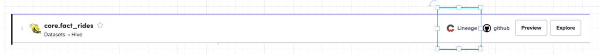
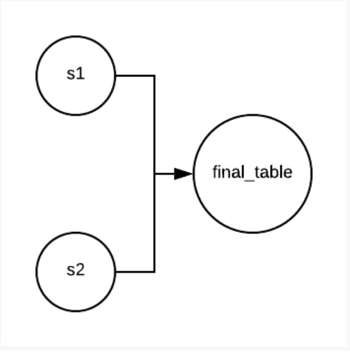
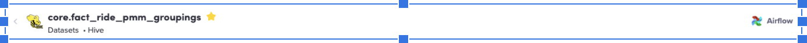
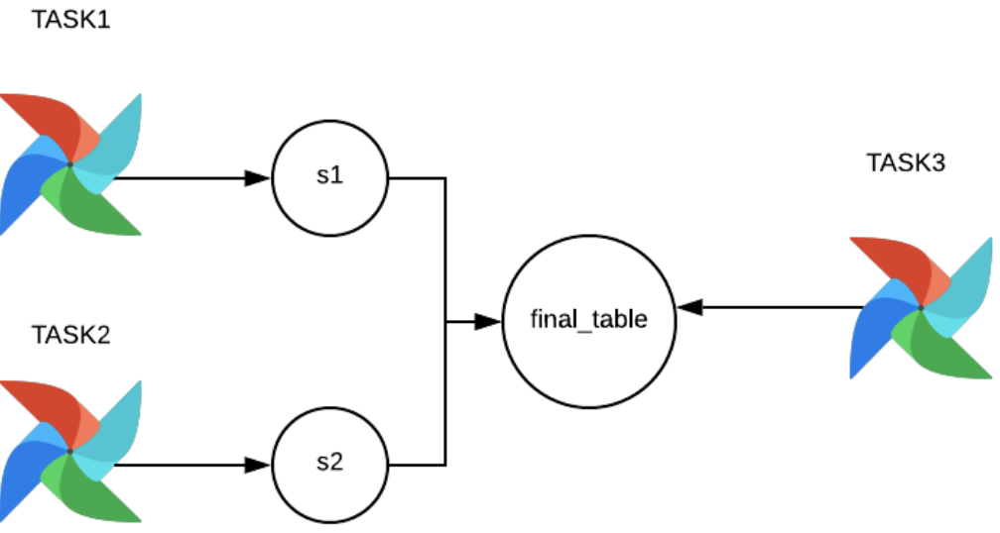
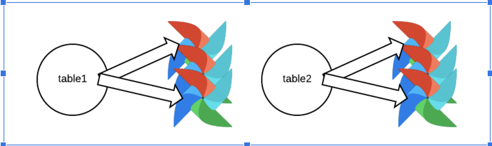

- Feature Name: (fill me in with a unique ident, my_awesome_feature)
- Start Date: (fill me in with today's date, YYYY-MM-DD)
- RFC PR: [amundsen-io/rfcs#0000](https://github.com/amundsen-io/rfcs/pull/0000) (after opening the RFC PR, update this with a link to it and update the file name)
- Amundsen Issue: [amundsen-io/amundsen#0000](https://github.com/amundsen-io/amundsen/issues/0000) (leave this empty for now)

## Support Lineage In Amundsen


This RFC drafts how lineage should be supported in Amundsen and why the feature is important for the trust in data initiative.


### Background

Lineage (or Data Lineage) describes the data origin, what happens to it and where it moves over time. Data lineage gives visibility while greatly simplifying the ability to trace errors back to the root cause in a data analytics process.([wiki](https://en.wikipedia.org/wiki/Data_lineage)).

Lineage could mean differently in different context:


*   _Table level lineage_:_ _which table is used as upstream / downstream of the table (dataset).
*   _Task and table lineage_: which Airflow task produces the given table. Which table is used by which set of tasks.
*   _Task level lineage_: which Airflow task is upstream / downstream for another Airflow task.
*   Column lineage: It tracks information in fine detail, at the level of particular columns rather than entire tables. It shows how data of a given column is generated based on upstream columns, and how it affects which downstream columns.
*   _Service and event lineage_: which service produces and generates the message for a given event table.

Currently Amundsen doesn’t support showing Table level lineage in the UI but instead redirect users to use  , which is a 3rd party tool at Lyft, to refer to the lineage information.



There are several caveats of this approach which negatively impacts user trust towards Lyft data asset:


*   The link to in-house lineage tool doesn’t always work. If the table/dataset is not indexed in in-house lineage tool, the user will get a 404 (e.g [user report](https://lyft.slack.com/archives/CBHCUQB2Q/p1584997367078000)).
*   The UI in in-house lineage tool is hard to browse the actual lineage as it displays the full lineage instead one level at a time (E.g [graph](https://in-house lineage tool.lyft.net/lineage-report/relation/warehouse.core.fact_rides.html?cwRelationContent=graph&cwRelationGraph=dataflow) )
*   The lineage information provided by in-house lineage tool has lots of noise. For example, it will put s3 path as upstream/downstream for a given data set.
*   Other popular OSS projects (e.g Apache Atlas) provide the UI support on lineage which is a feature gap for Amundsen adoption in the community.


### Why is lineage important for trust in data?

One main goal of data comprehension is to bring the trust for core datasets by capturing more metadata. Data lineage provides the audit trail of the data points at the highest granular level for datasets. For example, if an upstream table has data quality issues, it is highly likely that the downstream table has the same data quality issue.

Showing lineage information will help the oncall engineers to debug SEV / data issues. For example, if we have data issues for a set of events, we would like to quickly identify which are the downstream DAGs that got impacted and required to rerun.

Based on the above analysis, here we propose **capturing and showing lineage** information directly in Amundsen as part of trust in data work.


### Existing efforts for table lineage in Amundsen

Tamika has built a POC [UI](https://github.com/lyft/amundsenfrontendlibrary/pull/349) to show the table lineage as a good start.  Here a few things got captured during the POC:


1. **Product Focused**: Evaluate what features would make a solid MVP (minimal viable product). There are many features and interactions people would eventually love to have, so we should identify the requirements and keep the scope for the initial version reasonable.
2. **Design Focused**: Come up with an ideal design that takes into account the MVP requirements. I think design will be really important here since if we end up making something that is difficult to understand and interact with, the whole feature is sunk.
3. **Frontend Focused**: Rendering graphs are hard, really hard. For this proof of concept I leveraged the first library that allowed me to get a graph on a page. However there are many limitations. Perhaps we can focus on choosing whatever library gets us to MVP, take note of all the pain points along the way, and then revisit and try to introduce a better library that will allow us to scale this.
4. **Backend Focused**: Design the apis that will serve this information to the frontend and how lineage information will be ingested into Amundsen.


### Proposed Approach


#### 1: Ingestion and display the table lineage metadata

Given Amundsen work with different data warehouses(e.g redshift, Hive, snowflake, Bigquery, Delta), it doesn’t make sense for Amundsen itself to handle the lineage capture task as different data warehouses could have different sql dialects. For example, users could leverage [https://github.com/uber/queryparser](https://github.com/uber/queryparser) to capture table lineage for Hive. The lark library ([https://github.com/lark-parser/lark](https://github.com/lark-parser/lark)) allows users to rewrite lineage parsing toolkits based on different data warehouses.

Here shows an example of table lineage:

For the following sql:


```
INSERT INTO TABLE final_table
    SELECT s1,s2 FROM
      (SELECT count(*) FROM source_table1) AS s1
    JOIN
      (SELECT count(*) FROM source_table2) AS s2;
```



At Lyft, we rely on the lineage information captured in in-house lineage tool and persist into the Amundsen graph by filtering out the noisy information.

There are two approaches for lineage ingestion:


##### **Pull based approach**


1. Define a table lineage model. This model could serve as an example lineage model.
2. Build a databuilder lineage extractor, which depends on the upstream sources(e.g in-house lineage tool vendor, or delta table, etc), to leverage that model and extract the lineage information .
3. Build a UI popup on the Amundsen table page.


##### **Push based approach**

This is more a long term high level approach:


1. Define a generic lineage schema for a messaging system(e.g Kafka);
2. Allow upstream systems to publish lineage info to the lineage topic; have a downstream job(e.g databuilder extractor, or a streaming job to persist that info into neo4j sink).
3. Build a UI popup on the Amundsen table page.

We will leverage the pull based approach first then push based approach which is similar to how we capture other metadata currently at Lyft. And we have built [https://amundsen.lyft.net/table_detail/gold/hive/expiration/table_lineage](https://amundsen.lyft.net/table_detail/gold/hive/expiration/table_lineage) which has captured the lineage information from in-house lineage tool. We will need to finish the lineage POC to treat the lineage information  as the first class citizen in Amundsen.


#### 2: Ingestion and surface the task->table, inter-task and service->table lineage

Currently Amundsen provides which Airflow task produces which table with the [application](https://github.com/lyft/amundsendatabuilder/blob/master/databuilder/models/application.py) model.





But currently workflow/ DAG **is not** a first class entity(dataset, user, dashboard) in Amundsen, Amundsen doesn’t provide any visibility on DAG, especially P0,P1 DAGs that produce executive dashboards.

For example, one common question has been asked in SEV11356 and other previous SEVs as well:




**_“If we know a set of tables/events are impacted, which DAGs/Tasks need to rerun?”_**

In a past SEV at Lyft, the S3 path of a set of events have been deleted by accidents. Once the data of the event is recovered, the oncall would like to understand **which DAGs/ Tasks are impacted** by that set of tables so that it needs to rerun.

Furthermore, if we index **inter-task dependency**, we are able to tell which 2nd or even 3rd level of DAG/ Task needs to rerun. Currently, it relies on users to self report on which table got affected then traced by which tasks need to rerun.

I think we should at least show which Airflow tasks (especially P0,P1 DAGs) leverage for a given table.

We could consider treating the **[service](https://amundsen.lyft.net/table_detail/gold/hive/etl/data_platform_event_owners)** as a separate node in the graph when we display which event produced by a given service.
