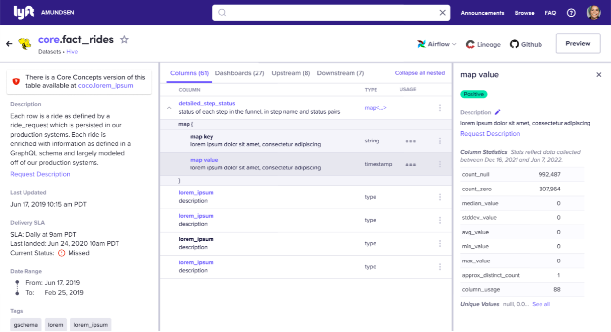

- Feature Name: Nested columns
- Start Date: 2022-03-24
- RFC PR: [amundsen-io/rfcs#0000](https://github.com/amundsen-io/rfcs/pull/0000) (after opening the RFC PR, update this with a link to it and update the file name)
- Amundsen Issue: [amundsen-io/amundsen#0000](https://github.com/amundsen-io/amundsen/issues/0000) (leave this empty for now)

# Nested columns

## Summary

We look to improve how we display nested columns in Amundsen, by iterating on our initial version. In particular, we want to:
1. Allow users to expand/collapse all nested columns in the view, and repurpose the ⌄ icon to enable drill down of each hierarchy level
2. Properly display nested columns’ metadata (including description, badges, stats) and allow users to edit them
3. Distinguish how we display nested object without named fields (e.g. Array and Map) vs. a nested object with named fields (e.g. Struct/Message)

## Motivation

As we look to add more metadata (such as description and stats) for nested columns, the ⌄ icon to expand column details will clash with current use of ↳ icon next to it, making the indentation for hierarchy hard to read and crowding the control area. (See more rationale for overall layout and interaction changes in the [Column details access and side panels RFC](./000-column-details-access-and-side-panels.md))

Also, always showing all nested columns can make the list too long to scroll through.

Finally, there are instances where the nested object we want to display does not have any named fields, such as in Array and Map type nested columns. We will distinguish these from a nested object with named fields (e.g. Struct type nested column), in order to properly represent and highlight the different types of hierarchy. 
Therefore, this round of enhancements will support use cases like:
* “I want to put a badge for just this nested column to indicate it is deprecated or reporting safe”
* “I want to change the description for each level of nested columns”
We expect these changes will enable our users to navigate and explore nested columns more easily and intuitively, encourage owners to add and maintain higher quality metadata, and help users to clearly understand the hierarchy of all types of nested columns.

## Guide-level Explanation (aka Product Details)

We have enhanced the way we represent nested columns, including the navigation and a layout change to showcase more metadata per nested columns.
You can expand/collapse all nesting using the text button at top right corner.
Please note that ⌄ icon is now used for expanding each level of nesting, rather than opening the column details within the list. Instead, when you click on the name of any column, you will see all its metadata in the dedicated right side panel. You can always close the panel to see more of the list.
The hierarchy of nested objects without named fields (e.g. Array and Map) are now better specified and distinguished from nested objects with named fields (e.g. Struct).

## UI/UX-level Explanation

###Expand/collapse all + each level drill down

* As default, all nested columns will be expanded, showing the option for user to ‘Collapse all nested’
* For most complex tables, this default behavior should still load fine, but in the edge case that there are prohibitively many columns to render (threshold will likely be ~1000), we may need to start with an all collapsed view for performance reasons.
* Any nested columns (except for the top-level/parent column) will be a darker color to recede into the background, which can help users distinguish when quickly scanning the list.
* The table header will be stick to the top at all times so users can always tell what the columns are as they scroll.

* When the user clicks the ‘Collapse all nested’ text button, the list will only show top-level or non-nested columns.
* The up/down chevron that used to expand each column row to show full description and stats within the list area, will now change in functionality to expand/collapse each (one at a time, not all) level of the nested column. Therefore, only nested columns will have a chevron, and a column without any nesting under it will not have a chevron.

* Users can keep clicking on the chevron to expand each level of nesting if they want to  drill down the path without expanding all nesting at once.

* Clicking on a column name opens the right side panel to display all column details, including badges, description, and stats.
* Only the columns with metadata will be displayed in interactive (Indigo 60) color, so that users can tell whether they will see useful information by clicking on its name.
* For the new right side panel and layout, see details in the [Column details access and side panels RFC](./000-column-details-access-and-side-panels.md).
* In the edge case so many nested levels indent the list too much, users can still side scroll or widen the browser. 

### Nested object without named fields (e.g. Array and Map)

For nested objects without named fields (e.g. Array and Map columns), we will use a short row below to clarify and highlight the nesting/hierarchy, even if they don’t have any children columns to display. We are showing examples below to handle Array and Map columns, but this approach can be applied to better represent other nested objects without named fields.

#### Example 1: Array
Showing **array[array[array[struct]]]**

* For Arrays, we will show a short row below the array column to highlight this nested column type. In this example, you can see how an ‘array [ array [ array [ struct ] ] ]’ would be represented differently from an ‘array [ struct ]’
* For array[struct] or array[map], show the children rows of struct/map under the array column.
* We will keep the clickable column type link so that users can see further nesting in the existing modal.

* For array[string] or other terminal columns (without any children), no extra rows are shown below.

#### Example 2: Map

* For Maps, the short row below will show ‘map { }’ and then display ‘map key’ and ‘map value’ rows underneath, with their own types specified.

* If it includes nesting within the map, apply the same logic as any struct/map/array. Above example show how you would display **foo:map{string,struct[bar:string]}**

* Combination of Array and Map could look like above example, showing an **array[map]**

## Reference-level Explanation (aka Technical Details)

In the current implementation, the type details shown in the table details view to describe nested columns are all handled by frontend parsing of the column type strings. This does not allow for associating other information to each level of nesting such as descriptions, badges, and other metadata, nor does it allow for indexing the nested columns so they can be searchable. Databuilder now has a ComplexTypeTransformer available that can be configured with a parsing function. This transformer can parse the column strings and store the nested columns as TypeMetadata on the backend. This PR shows the initial work to implement this, and this PR shows some additional changes to the parsing for a Hive type parser. This data will be accessible through the table metadata API and can be used to replace the frontend parsing to be displayed to users as described in this RFC.

## Drawbacks

We had implemented the first version of Nested Columns with a few compromises such as below, in order to release a solution with manageable scope:
* permanently expanded view lengthens the column list and is hard to navigate or drill down
* ↳ icon for nested columns doesn’t leave much room to add expand column details CTA
* We focused on representing hierarchy for nested objects with named fields (e.g. Struct/Message) but it didn’t display the hierarchy for nested object without named fields (e.g. Array and Map) correctly
This enhancement requires layout change, existing component (chevron and column details area) behavior change and a new right side panel (See [Column details access and side panels RFC](./000-column-details-access-and-side-panels.md)), but we think it is the opportune timing and an investment to make Amundsen and Nested Columns more extensible. 

## Alternatives

We have explored several directions and decided against them because…

### Chevron to expand nesting, + icon to open column details

* The chevron feels appropriate for expand/collapsing hierarchy in the list, but it’s not easy to add another CTA that will open column details in the same area (near column names)
* Two types of expanding actions in the same list can easily take up a lot of vertical space, making it hard to scan and compare multiple columns

### Table metadata in search results page, column metadata in table page

* We thought about removing the table metadata section from the table details page to make more room and show column info, but it’s important to see the table metadata together with the list of columns.

* A dedicated panel will help properly show all column metadata, but it didn’t have to be this wide.

### Nested object without named fields (e.g. Array and Map) variations
We debated a lot on the optimal way to highlight and distinguish the hierarchy of nested object without named fields, and the concepts we considered below were inferior to the direction we chose in terms of the clarity and visual design.

## Prior art

This project comes from the user feedback and shortcomings of our current POC for supporting nested columns.

## Unresolved questions

Decide whether we need to load a collapsed view as default in the edge case that there are prohibitively many columns to render, and what the threshold should be.

## Future possibilities

We could add a breadcrumb at the top of right side to help users see the whole path with clickable shortcuts:

* If the column is deeply nested and we cannot show all intermediate steps of nesting, we can truncate between the top-level column name and the last two levels of current selection. Users can click on the truncation ‘...’ icon to see a dropdown list of all truncated steps. 