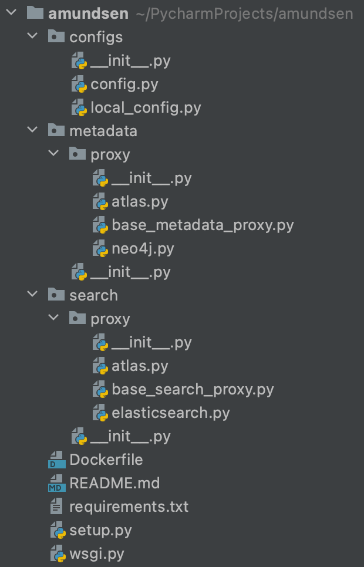
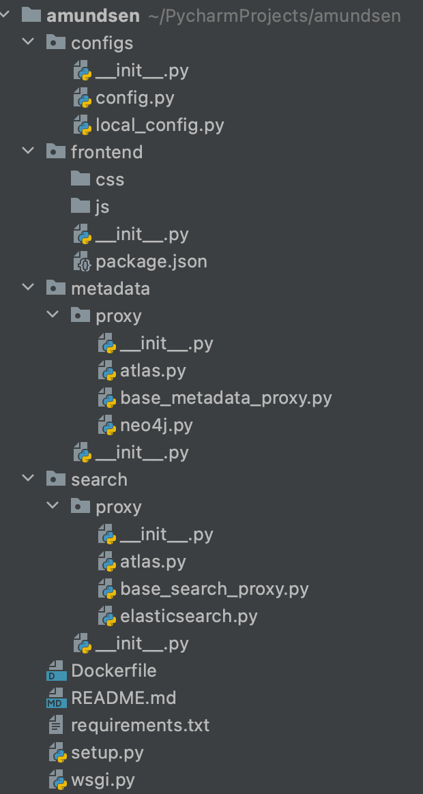
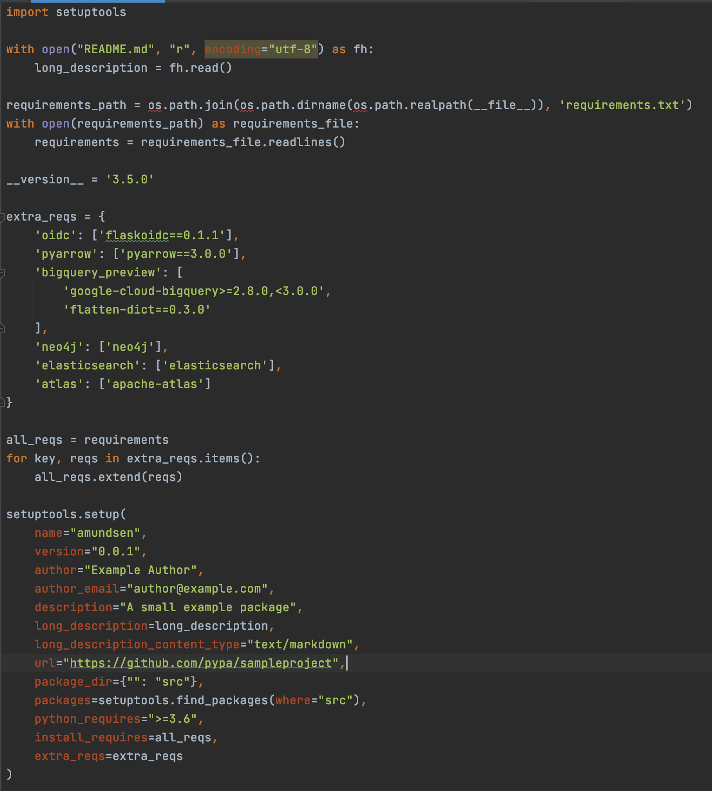

- Feature Name: consolidate_amundsen_microservices
- Start Date: 2021-03-23
- RFC PR: [amundsen-io/rfcs#30](https://github.com/amundsen-io/rfcs/pull/30)
- Amundsen Issue: [amundsen-io/amundsen#0000](https://github.com/amundsen-io/amundsen/issues/0000) (leave this empty for now)

# Consolidate Amundsen Microservices

## Summary

The idea is to (eventually) deprecate the split of `amundsenmetadatalibrary`, `amundsenfrontendlibrary`, `amundsensearchlibrary` and `amundsencommon` repositories, and merge them all into one mono repository. The split will instead be based on the backend and frontend.

Following will be the repositories (and packages) of Amundsen after the change.
- amundsen (frontend, metadata, search, and common repositories)
- amundsendatabuilder (Same as today's databuilder repository)

There will not be a separate `amundsenmetadatalibrary`, `amundsenfrontendlibrary`, `amundsensearchlibrary` or `amundsencommon` packages. 
**No data will be lost from the database or search engine, as we will not be changing any models or data structure.** 

## Motivation

At the moment, the Amundsen project is divided into multiple very thin backends or proxies, which are backed by other projects/databases/search services like Neo4j, Atlas, Neptune, etc. 

Following are the Python/Flask based proxies powers the Amundsen project:
- amundsenfrontendlibrary
- amundsenmetadatalibrary
- amundsensearchlibrary
- amundsencommon 

This architecture creates the following issues and is making it hard for companies to adopt Amundsen, and to customize it accordingly. 
I've also added a note under each item explaining how this change will solve this issue.  

#### 1: Dependency Management
Python packages are pretty much the same for each proxy, which makes it hard to sync across all the above repositories. As a result most of the time, each proxy is running its own version of the dependency. 

A few examples:

| Package             | amundsenmetadata   | amundsenfrontend  |
| ------------------  |:------------------:| -----------------:|
| amundsen-common     | >=0.8.1            | ==0.6.0           |
| flake8              | ==3.5.0            | ==3.8.4           |
| flake8-tidy-imports | ==1.1.0            | ==4.2.1           |

and many more... 

*This change will put all the packages in just one place, making it easier to manage dependencies and no multiple variants of the same package.*

#### 2: Development Efforts
Having multiple repositories makes it really hard to implement a feature. Implementation and testing require efforts to synchronize and then code reviews, and finally, all the PRs across multiple repositories need to land in master at a certain time or at the same time. 

*This change results in faster local development, one PR to fix a bug or a feature, no dependency hell as we are facing today, hence attract more contributors.*

#### 3: Customization & Deployments
One of the frequently mentioned topics re Amundsen is the complexity of the architecture, and the efforts required to customize Amundsen. Having multiple repositories results in multiple components to install, customize, manage and fix.

*This change will make the customization much easier and the deployment will be pretty straightforward, with only 2 components. No multilevel docker files, easy maintenance of the infrastructure.* 

Custom endpoints will still be injectable the same way we are doing today. We will write a blog/tutorial around each customization.

#### 4: Code Duplication
From requirements to config files, models, helper functions, exceptions handling, CI/CD pipelines, Docker files, and other repository management like licenses, PR/Issues templates, etc., is pretty much the same in all these microservices. Change in one repository deviates that repository from others at the moment. 

*This change will move all the above into a single repository making it easy to change anything without keeping track of multiple repositories, and redundant code.* 

Having one config file does NOT mean we can not have the incubator integration. It will be the same process as of today i.e., a separate incubation repo, which implements the required methods, and then install that as a requirement and set that as a proxy within the config file.

## Transition Path
Most of the code is already there and is spread across multiple repositories. I can see this happen in multiple phases.

#### Phase I:
Merge `amundsenmetadatalibrary` and `amundsensearchlibrary`. This should not take too long and will be easy to maintain the same URL patterns for each under separate directories within one repository. 
The new repository will be named `amundsen`. During this period the `amundsenfrontend` repository will be unchanged and will work as it is. 

Metadata and Search will have their own Flask blueprints. 
- /api/metadata/
- /api/search/

During this phase, we will freeze the codebase for `amundsenmetadatalibrary` and `amundsensearchlibrary` repositories for any new features. Security patches will still be approved and merged.

A very high level of how the directories will look like after this phase is below:

#### Phase II:
In this phase, we’ll deprecate the `amundsenfrontendlibrary` and `amundsencommon` repositories/packages. 
We’ll move the react application as-is in the `amundsen` repository. 
Next will be to deprecate the frontend codebase completely and call the metadata and search endpoints directly from the frontend react application. This will completely remove the frontend Flask codebase. 
All the custom endpoints will be moved to the `amundsen` repository. 

Below is how the folder structure looks like, along with the setup.py file on how to do we set up the dependencies.

## How We Communicate This

- We'll promote this RFC frequently on Amundsen Slack and other social media channels, so to get feedback from the community.
- During the community meetings, update on the progress and phases. 
- We'll write a Blog/Tutorial about this change on how to migrate your existing Amundsen deployment to this new architecture.

Since this will change the way we deploy and install the Amundsen project, we will not remove any of the existing repositories i.e., amundsenmetadatalibrary, amundsensearchlibrary, amundsenfrontendlibrary.
We will add a deprecation warning on each readme and packages page where applicable, and introduce the new way i.e., a mono-repo, along the way. All the new work will be done in the new repository. 

## Drawbacks

For each phase mentioned above, we may need to freeze development to the respective repository. Although it should not take too long to merge multiple repositories, there still can be unforeseen issues that delay the process.

## Alternatives

1. We do not change anything and live with the existing architecture. This will eventually result in dependency hell, redundant code, and a complex network of repositories.

1. An alternative could be to merge all 4 microservices into a single repository i.e, frontend, metadata, search, and common would simply become `amundsen-io/amundsen` repository. 

    For proxies we'll have separate packages. i.e., `amundsen-io/metadataproxy` and `amundsen-io/searchproxy`. 
    - metaproxy: Will hold the neo4j, atlas, rdbms, neptune etc. 
    - searchproxy: will have the implementation of elasticsearch, atlas etc., 

    We'll install amundsen as `pip install amundsen`, and this will install the amundsen project without any proxy for metadata or search, hence make it a core project without any custom dependencies for anyone. 

    Config option in amundsen repository, to select the proxy will be: 

    - METADATA_PROXY = "amundsen_metadataproxy.proxy.neo4j" 
    - SEARCH_PROXY = "amundsen_searchproxy.proxy.elasticsearch" 

    and we'll install proxies like this. 
    
    - `pip install amundse-metadataproxy[neo4j]`
    - `pip install amundsen-searchproxy[elasticsearch]` 

    This will make the whole codebase much lighter and not dependent on any specific proxies or packages like neo4j, apache-atlas, neptune, etc., 

1. Deprecate the split of metadata, search, and amundsencommon repositories, and merge them all into one mono repository, and call this `amundsenbackend`. Remove the Flask based code from the frontend repository and call the metadata/search endpoints directly via the React app. 
    Summary: The split will instead be based on the backend and frontend.
    Following will be the repositories (and packages) of Amundsen after the change.
	- amundsenfrontend (Frontend React Application)
	- amundsenbackend (frontend flask application, metadata, search, and common repositories consolidated in this repository)
	- amundsendatabuilder (Same as today's databuilder repository)
    

## Unresolved questions
TBD
> What parts of this RFC are TBD?

## Future possibilities

This change can pave our ways to move Amundsen towards the next generation event-based system. More contributors and adopters will result in more integrations and diversity of features. 

Ref: https://engineering.linkedin.com/blog/2020/datahub-popular-metadata-architectures-explained
