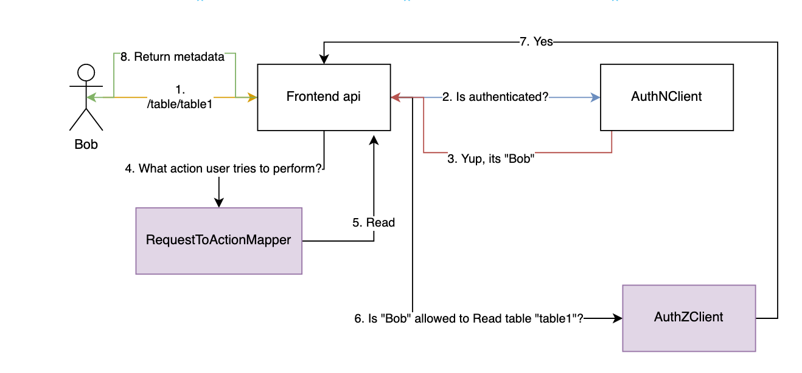

- Feature Name: Granular access control - Phase 1
- Start Date: 2023-01-22
- RFC PR: N/A
- Amundsen Issue: N/A

# Granular access control - Phase 1

## Summary

This RFC proposes first implementation of granular access control feature for Amundsen frontend.
**Included in phase 1**

* enforcing authorization rules specified in database
* filtering search query results (prevent users from seeing content they are not authorized to access)
* Basic UI (redirect to 'you are not authorized to access this resource' page)

After implementation of Phase 1, Amundsen users will be able to define set of granular authorization rules for users and groups by inserting authorization rules into database. 

I've also included [Demo PR](https://github.com/amundsen-io/amundsen/pull/2029), which aims to show an idea behind implementation of this feature. This PR implements authorization for "get_table_metadata" endpoint. Please take a look at `frontend/amundsen_application/authz_config.py`, as well as changes in `frontend/amundsen_application/api/metadata/v0.py` files.
Note that code on this branch won't fully reflect final implementation as it is subject to change as concept evolves. 

Phase 2 - see [Future possibilities](#Future-possibilities)

## Motivation

This feature was listed as one of mid-term plans in 2021 roadmap. Scenarios that may require granular access control include cases where:
* metadata contains sensitive information and can not be shared with everyone
* users should see only data from their business unit
* only admins and owners should be allowed to modify list of dataset owners


In longer term this feature could help with maintaning and administration of amundsen in more UI-driven fashion.


## Guide-level Explanation (aka Product Details)

### Authorization (Granular access control)
When you enable authorization, you can control permissions on objects stored in Amundsen. You can define user groups and manage permissions on different scopes (e.g. database, table). Granular access control can also support filtering query results. By default, Amundsen is using [Casbin](https://casbin.org/docs/overview) as the authorization client. 

### Default configuration
Access Control List (ACL) is the default model used in Amundsen. Each user (or group of users) can be granted either `READ` or `WRITE` permissions on given resource type and scope. For example, we can add a rule that will allow user `bob@org.com` to view (READ) metadata of all tables from schema `hive`.


### Config modification
Default authorization behaviour can be changed by modifying `authz_config.py` configuration file. You can define new permission types or change the way authorization rules are applied to given endpoint.

Apart from that, by modifying model configuration file of Casbin authorization client you can change access control model (for example to RBAC or ABAC).


### Technical details
Amundsen leverages Casbin to 
* check if user is authorized to access particular resource
* fetch permissions of user (in order to filter query results)

Authorization model is based on checking if "subject {S} is allowed to perform action {A} on object {O}". Rules are stored in the database that can be deployed together with the application.

Action permissions are defined on endpoint level. For example we define that 

> Later this section could be extended with hands-on demo of modyfing permissions


## UI/UX-level Explanation

Whenever unauthorized principal tries to access a resource, user should be redirected to a page with text `You are not allowed to access this resource`. Component should be modifiable via `config-custom.ts` (e.g. same way Badge Config works).

## Reference-level Explanation (aka Technical Details)

### Authorization flow
To abstract application code from access control model as much as possible, amundsen calls authorization client in order to verify that "subject {S} is allowed to perform action {A} on object {O}".

There are 3 components added to Amundsen frontend, which are described below.

**AuthorizationClient**
Proxy class that encapsulates authorization model and provides access to the database where access rules are stored. It implements methods that i.a.:
* Check if user is authorized to access the resource -  This method takes user context, resource type (e.g. table), resource id and action and returns a boolean.
* Modify elasticsearch query to filter the records that user should not be able to see (this is not implemented yet)

**RequestToActionMapper**
Given a context of a request, returns the corresponding action (e.g. READ, WRITE, DELETE). Example when user calls 
I’ve added this component, because access control based on the HTTP method and url may not be sufficient for some of the use cases and also in my opinion actions are more natural than POST or GET methods. Mappings can be configured by developers in a configuration file.

**BaseAction enum**
Enumerator with all possible actions (e.g READ, WRITE, DELETE) - developers can implement their own set of actions to meet  requirements for granularity.



### Authorization config
Authorization flow components can be modified by changing config located in `frontend/amundsen_application/authz_config.py` file. Please take a look at Demo PR linked above to understand rough idea behind this config file.

### Casbin policy
Authorization model is defined as a single `model.conf` file.
Take a look [here](https://casbin.org/docs/how-it-works) to understand how policies and models are defined. 

Current implementation in Demo PR:

`model.conf` file:
```
[request_definition]
r = sub,type, obj, act

[policy_definition]
p = sub, type, obj, act


[policy_effect]
e = some(where (p.eft == allow))

[matchers]
# match subject (e.g. user), match action(e.g. read), regex match type (e.g table), regex match object (e.g. table id)
m = r.sub == p.sub && r.act == p.act && regexMatch(r.type, p.type) && regexMatch(r.obj, p.obj)
```

Sample policy looks like this:
```
p, test_user_id, table, hive://*, read
```
Which can be read as "user 'test_user_id' has permission 'read' on resource type 'table' that matches 'hive://*'"

Note that current implementation does not have notion of group of users, but it can be easily modified (Check [here](https://casbin.org/docs/rbac))


## Drawbacks
As current model works on level of endpoint, it would require relatively high effort to implement it for whole application, as we would need to modify every function of every blueprint. Despite this, once we ship authorization for a single endpoint, implementation for consecutive ones should be much easier and faster.

## Alternatives
Since Amundsen stores mostly metadata, for majority of use cases granular access is not required, however I think almost everyone could benefit from simple model that allows defining READ/WRITE permissions on application level. Outlined concept certainly makes such scenario possible, however it may be an overkill. I think logic of application would be simpler by making such assumption, however most of code for granular control is already in place in Demo PR linked above. I am sometimes a bit frustrated with applications making certain assumption about granularity, so for for me it is important that users can adjust granularity by modifying config files.


## Prior art
DataHub implemented [granular access control](https://datahubproject.io/docs/authorization) for their application.

It supports two ways of managing permissions:
* [Roles](https://datahubproject.io/docs/authorization/roles) - very simple permission mode with three roles (Admin, Editor, Reader) - roles are applied on application level, hence they are not really granular
* [Policies](https://datahubproject.io/docs/authorization/policies) - Allow to define fine-grained access. This model follows 'Subject, Action, Object' paradigm. 

Policies can be applied on scope of  
* resource (URN)
* domain (logical boundary)
* type (dataset, chart) etc

Main advantage of DataHub's granular access policies is very convenient [UI](https://datahubproject.io/docs/authorization/access-policies-guide/). Main limitation is that (contrary to Casbin) it does not support wildcards in policies. "Ability to define Metadata Policies against multiple reosurces scoped to particular 'Containers' (e.g. A 'schema', 'database', or collection')" is under consideration for implementation. Authorization enforcer used by DataHub is custom application-specific solution.


## Unresolved questions

### Which adapter should we use for casbin?
Available [adapters](https://casbin.org/docs/adapters).
I think using PostgreSQL with [Sql alchemy adapter](https://github.com/pycasbin/sqlalchemy-adapter) should be the easiest option.

### How to make granular access control optional?
It should not be necessary to download casbin and its dependencies unless granular access control is used.  
What is the recommended way to skip installation of casbin if authorization is not used?
Also, since casbin would require some backend for storing the data (e.g. postgres), how we would like to add it to docker compose? Should we have a separate file (e.g. `docker-compose-with-authz.yml`)?

### Filtering elasticsearch results based on authorization rules
In theory, it should be possible to whitelist elastic search records, by getting [all permissions of users](https://casbin.org/docs/rbac-api#getimplicitpermissionsforuser) and adding it as filter to search query, however i have never tested it so i am not sure how easy it will be to integrate it with current app.

### Default granularity
Current default authorization model implements two possible actions (READ and WRITE) for every resource type (Table, Dashboard etc). Limitation of that is that it won't support complex scenarios such as "user should be able to modify **table tag**, but not to modify table description", however this level of granularity could be achieved by modifying [authz_config.py]() file*. For me current setting is good tradeoff between simplicity and granularity, but I am happy to discuss it.

**Just to be 100% transparent, such granularity would possible, but cumbersome to enforce in current Demo implementation, however I know how to support it easier and I am happy to implement that*.

## Future possibilities
* API for permission management (add group, add user, add user to group, add permission)
* Syncing users and groups from IdP
* UI for permission management (we could then extend default permission model by `MANAGE` permission type, which would allow to call permission management API on certain scope)
