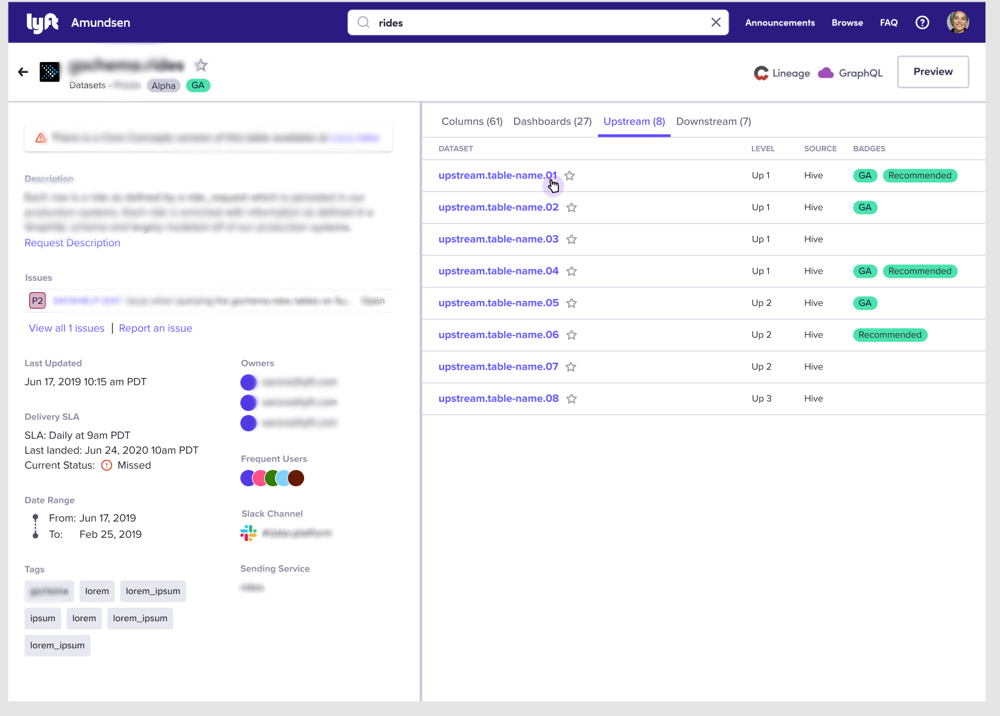
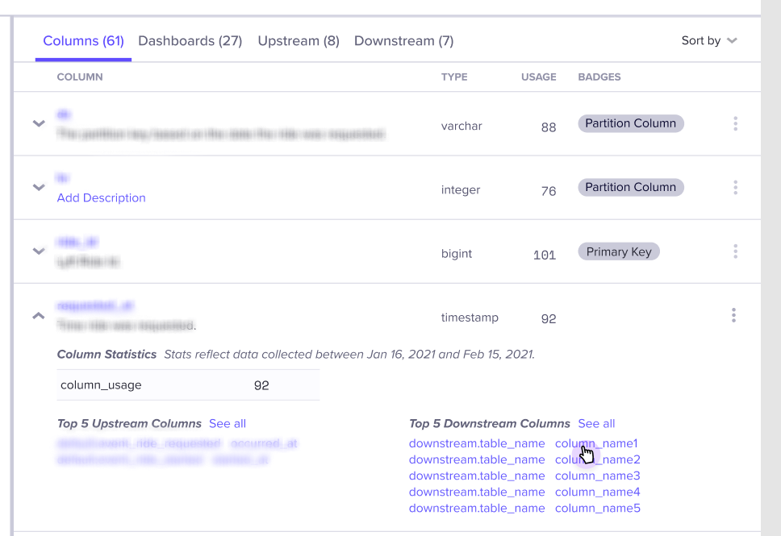
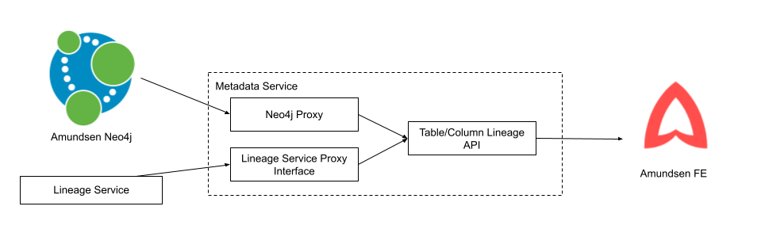

- Feature Name: lineage_stage_0
- Start Date: 2021-02-22
- RFC PR: [amundsen-io/rfcs#25](https://github.com/amundsen-io/rfcs/pull/25)
- Amundsen Issue: [amundsen-io/amundsen#0000](https://github.com/amundsen-io/amundsen/issues/0000)
# Amundsen Lineage - Stage 0

## Summary


Currently Amundsen doesn't have a way of surfacing lineage information for tables and columns. The idea for this first iteration is to have a way to show upstream and downstream tables and columns to users through the Table Details page so they can explore the current resource's lineage as well as navigate to related resources in Amundsen.
The first iteration is meant to be a fast implementation of the feature that we can get feedback on and improve in future iterations.

## Motivation

Lineage is essential to improving data discovery in Amundsen because it allows users to know where the data for a given resource is coming from as well as where this data is used downstream. 


## Guide-level Explanation (aka Product Details)

### New Concepts
- Lineage: Lineage is a term that describes the flow of data from one entity to another. While this term can broadly include everything from services, events, ETLs, and dashboards, we will focus on table-to-table and column-to-column data lineage in this RFC. 
- Upstream: Upstream is a relative term that describes data sources from which we inherit. Data flows from upstream to downstream.
- Downstream: Downstream is a relative term that describes data entities which consume our data. 

This feature will expose upstream and downstream tables and columns within the `Table Details` page.

Those implementing Amundsen should keep in mind that this feature is meant to provide them with a way to surface their existing lineage data by calling the service containing that data from the metadata service. This iteration won't provide a model to persist lineage on neo4j, but rather a gateway to lineage data so it can be included on lineage API responses to displayed in frontend. It is also important to understand that the feature will be disabled by default and can be enable through configuration.


## UI/UX-level Explanation



We will add two additional tabs to the `Table Details` page, `Upstream` and `Downstream`. Each tab will contain a list of tables from which data is inherited or consumed. This allows users view a table's lineage in a very simple manner.



Additionally we will add lineage information at the column level, viewable by expanding column metadata.

These features will only appear when the lineage feature is enabled.

## Reference-level Explanation (aka Technical Details)
### Architecture



Implementing this feature will require defining a Lienage API on the metadata service for Tables and Columns. When the API is called it will make calls to neo4j and whatever the source of lineage data is. An interface needs to be created to interact with an implementer's lineage service in a generic way. The data from the calls to these services will be put together to form the lineage response as defined below.

### Backend Implementation

#### Table Lineage API

_The table details page must list X levels of downstream and upstream dataset name, level, source (database), badges, on the DOWNSTREAM and UPSTREAM tabs. These datasets should also be sortable by usage._

When the user clicks the DOWNSTREAM or UPSTREAM tabs on the table details page, either of 2 requests to metadata will be executed containing lineage direction (upstream/downstream) and depth (levels):

```https://amundsenmetadata.com/table/current_table_key/lineage?direction=upstream&depth=1```
OR
```https://amundsenmetadata.com/table/current_table_key/lineage?direction=downstream&depth=1```
will be executed and the lineage call will return a response:
```
{
  “key”: “current_table_key”,
  “direction”: “upstream”
  “upstream_entities”: [
    {
      “table”: “table_key1”,
      “level”: 1,
      "source": “hive”,
      “badges”: [“core”, “beta”],
      “usage”: 234,
    },
    ...
  ],
   “downstream_entities”: []
}
```
OR
```
{
  “key”: “current_table_key”,
  “direction”: “downstream”
  “upstream_entities”: [],
   “downstream_entities”: [
    {
      “table”: “table_key2”,
      “level”: 1,
      "source": “hive”,
      “badges”: [],
      “usage”: 45,
    },
    ...
  ]
}
```
#### Column Lineage API
_The expanded view of a column in the table details page must display lists of upstream and downstream columns at the same time._ 
When the user expands the column to see more details 2 requests to metadata will be executed as follows:
```https://amundsenmetadata.com/table/current_table_key/column/column_name/lineage?direction=both&depth=1```
and the lineage call will return a response:
```
{
  “key”: “current_table_key/current_column_name”,
  “direction”: “all”
  “upstream_entities”: [
    {
      “key”: “table_key1/column_name1”,
      “level”: 1,
      "source": “hive”,
      “usage”: 234,
    },
    ...
  ],
  “downstream_entities”: [
    {
      “key”: “table_key2/column_name2”,
      “level”: 1,
      "source": “hive”,
      “usage”: 45,
    },
    ...
  ]
}
```
## Drawbacks
> Why should we _not_ do this?
> Please consider:
> Implementation cost, both in term of code size and complexity
> Integration of this feature with other existing and planned features
> The impact on onboarding and learning about Amundsen
> Cost of migrating existing Amundsen installations (is it a breaking change?)
> If there are tradeoffs to choosing any path. Attempt to identify them here.
## Alternatives
> Why is this design the best in the space of possible designs?
> What other designs have been considered and what is the rationale for not choosing them?
> What is the impact of not doing this?
## Prior art
> Discuss prior art, both the good and the bad, in relation to this proposal. A few examples of what this can include are:
> Does this feature exist in other data search applications and what experience have their community had?
> For community proposals: Is this done by some other community and what were their experiences with it?
> Papers: Are there any published papers or great posts that discuss this? If you have some relevant papers to refer to, this can serve as a more detailed theoretical background.
> This section is intended to encourage you as an author to think about the lessons from other projects, provide readers of your RFC with a fuller picture. If there is no prior art, that is fine - your ideas are interesting to us whether they are brand new or if it is an adaptation from other projects.
## Unresolved questions
> What parts of the design do you expect to resolve through the RFC process before this gets merged?
> What parts of the design do you expect to resolve through the implementation of this feature before stabilization?
> What related issues do you consider out of scope for this RFC that could be addressed in the future independently of the solution that comes out of this RFC?
## Future possibilities
> Think about what the natural extension and evolution of your proposal would be and how it would affect the project as a whole in a holistic way. Also consider how the this all fits into the roadmap for the project and of the relevant sub-team.
> This is also a good place to "dump ideas", if they are out of scope for the RFC you are writing but otherwise related.
> If you have tried and cannot think of any future possibilities, you may simply state that you cannot think of anything.
- Persist lineage data on neo4j: create extractors for databuilder library to extract the data and publish it
- Implement lineage graph view for better discovery experience
- Introduce a Task entity on Amundsen to surface pipepline tasks between tables and column and understand what tasks are repsonsible for generating tables
