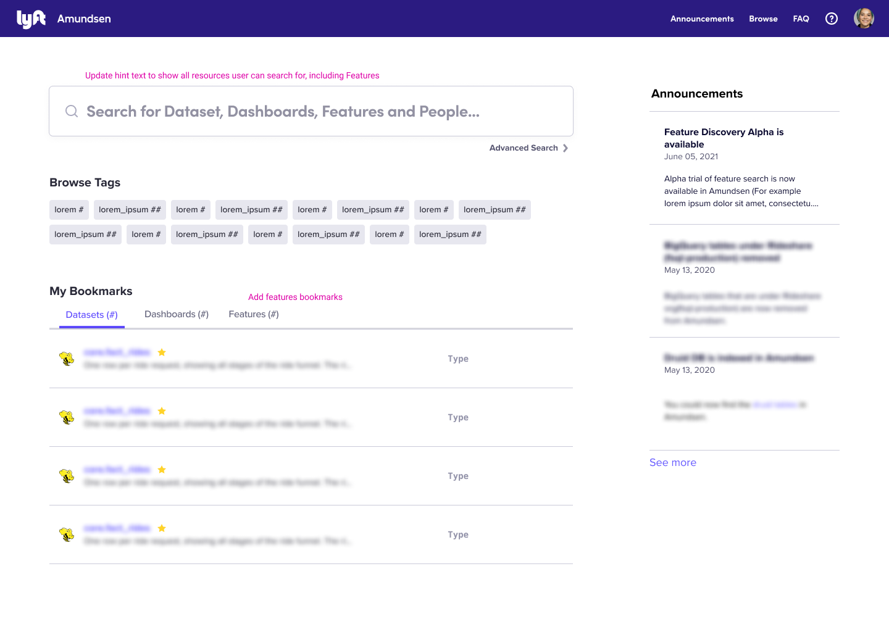
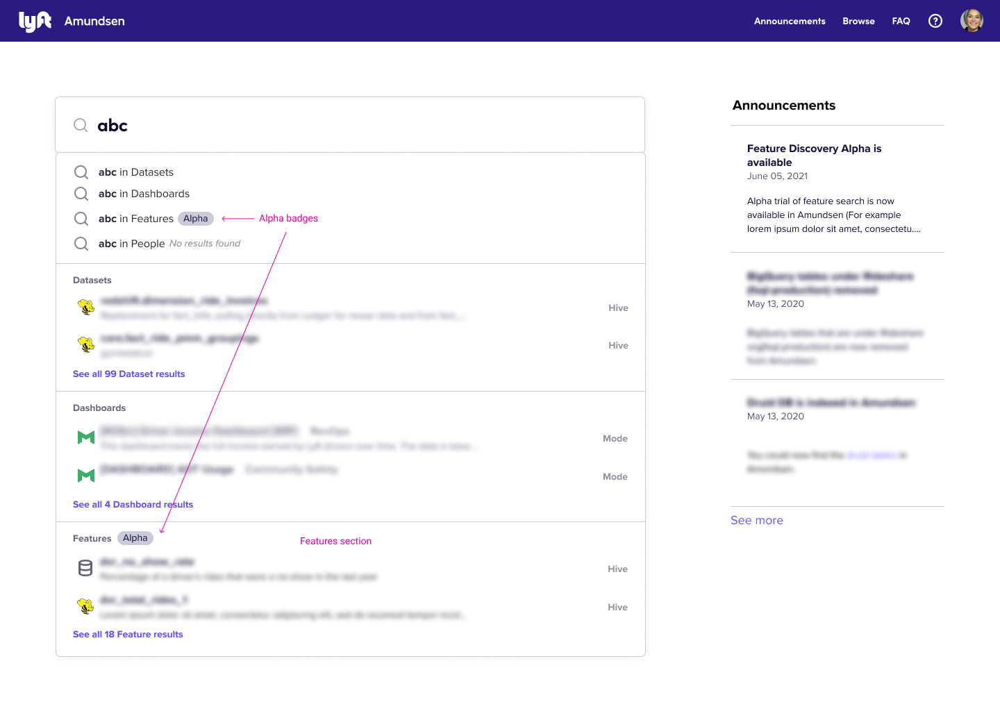
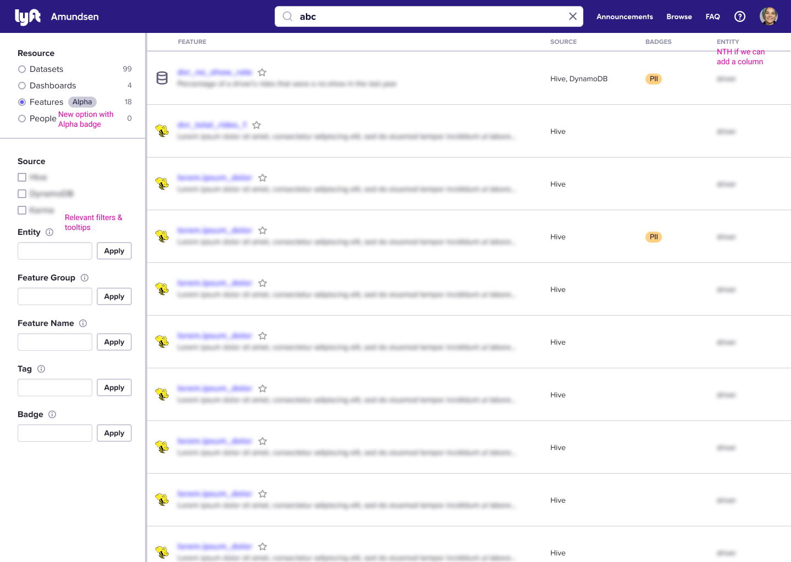
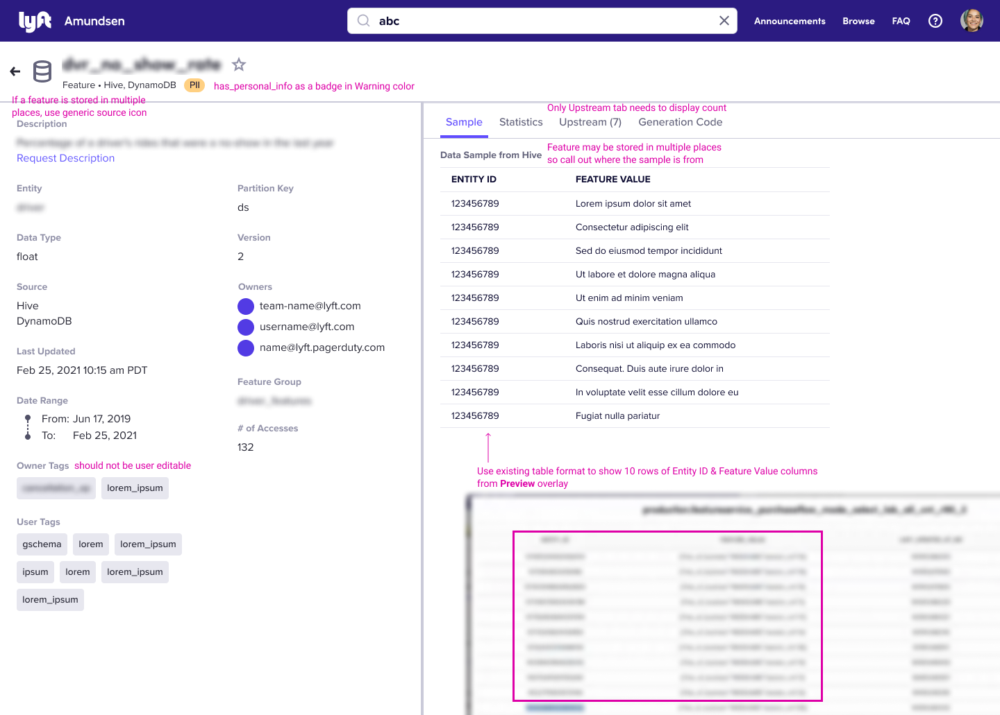
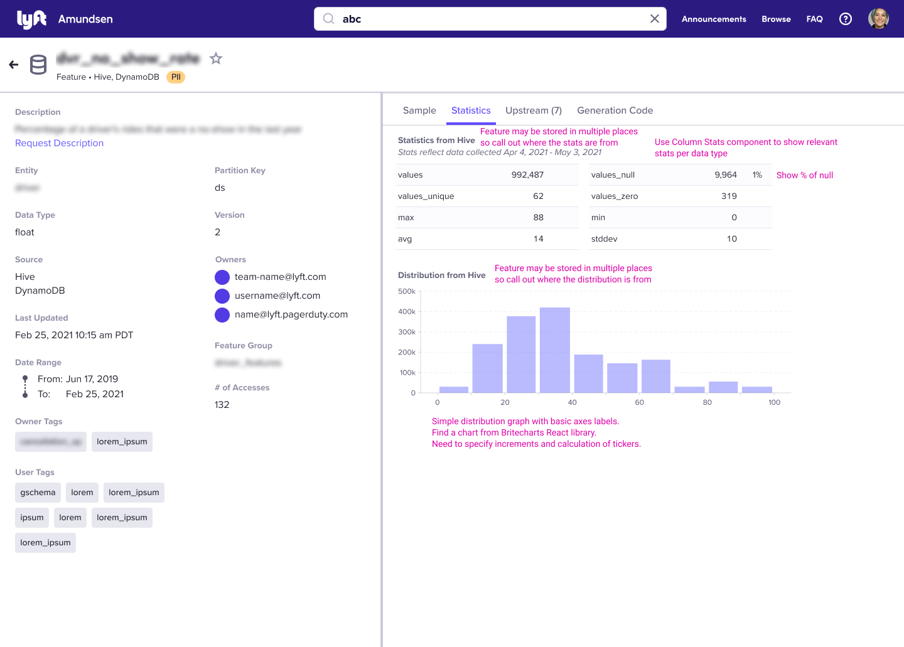
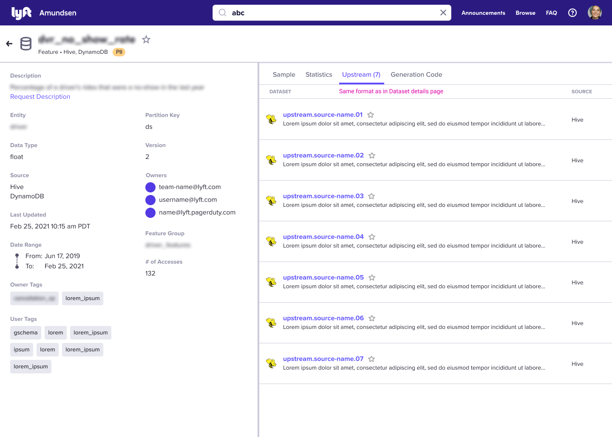
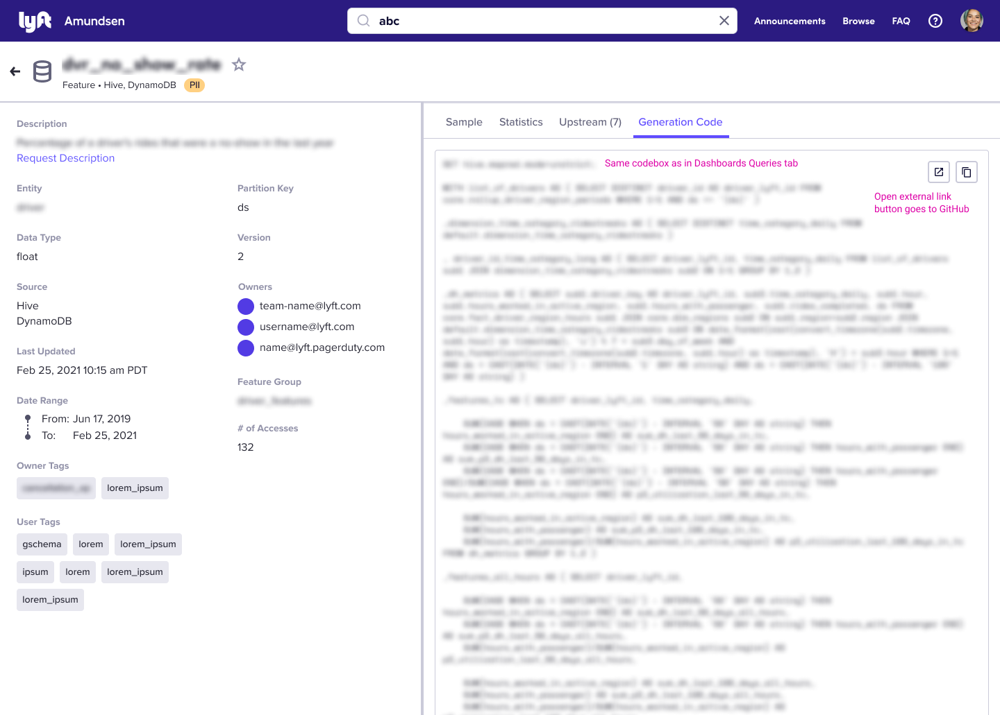

- Feature Name: ml_feature_discovery
- Start Date: 2021-05-05
- RFC PR: [amundsen-io/rfcs#36](https://github.com/amundsen-io/rfcs/pull/36) (after opening the RFC PR, update this with a link to it and update the file name)
- Amundsen Issue: [amundsen-io/amundsen#0000](https://github.com/amundsen-io/amundsen/issues/0000) (leave this empty for now)

# ML Features Discovery in Amundsen

## Summary

Amundsen currently indexes a few first-class entities, however we currently do not index any ML features that are easily discoverable for users. The goal of this work is to index ML features at the same level as Tables, Dashboards, and People resources in Amundsen.

## Motivation

Integration of ML projects in Amundsen has been heavily requested by the community and has already been implemented by other similar projects. This RFC outlines what will be the first step towards indexing ML projects in Amundsen since feature engineering is one of the most time consuming processes for ML engineers. Providing them with the ability to easily discover features that they can reuse for their models will significatly increase their productivity.

## Guide-level Explanation (aka Product Details)

### New Metadata Definitions
#### Semantic Metadata
Metadata related to the feature itself.
- Key: what makes a feature uniquely identifiable is the group, name and version. We don’t use db/source because the same feature can exists in different places (like hive and dynamo)
    - ex: test_feature_group_name/test_feature_name/1.2.0
- Availability/sources: list of places where feature is available
- Name: the name of the feature
- Version: the version of the feature
- Data type
- Description: optional, a description of the feature
- Owners: individual and team emails of owners
- Feature group: a way of grouping features, can be defined differently in each company, in this case we assume this will be the name of the pipeline that produced the features
- Entity: a way of grouping features semantically by using nouns
- Owner tags: programmatically generated and not editable tags, useful to group features base don the specific engineering team using them
- User tags: normal amundsen tags
- Contains PII: weather a feature contains PII or not, will be a badge in the badges list
- Date range: what time frame is the data in the feature for
- Partition column: optional column associated to the feature to indicate partition

#### Operational Metadata
Metadata to facilitate the use of the feature by other engineers.
- Code snippet/SQL: snippet of code that generated the feature and external URL to more details
- Last updated: timestamp for when the feature was most recently updated
- Usage: number of accesses to the feature, usage in models out of scope for MVP since we are not indexing models yet
- Upstream resources: upstream lineage in the form of tables, could be expanded to anything else in the future (column, service, pipeline)
#### Data Pattern Metadata
Metadata that describes qualities of the data in this feature.
- Data sample: a sample of the data which the feature contains shown as a table
- Statistics: any stats relevant to the feature data


## UI/UX-level Explanation
_**Note:** The pink text is only visible in the mocks to call out design details and changes._
### Home Page

##### Expanded Search Bar

### Advanced Search Page


### Feature Details Page
##### Sample Tab

##### Statistics Tab

##### Upstream Tab

##### Generation Code Tab


## Reference-level Explanation (aka Technical Details)

### Amundsen Databuilder
The databuilder library will be expanded to include a feature Model that includes the following:
#### Nodes
- Feature node:
    - Key
    - Name
    - Version
    - Feature group
    - Entity
    - Data type
    - Last updated
#### Relationships
Here we show the relationships between feature and other nodes, as well as the metadata that this represents: 
- Feature <FEATURE/FEATURE_OF> Database
    - Availability
- Feature <COLUMN/COLUMN_OF> Column <> Badge
    - Partition column
    - Note: this column key will have feature key in key instead of a table key
- Feature <DESCRIPTION/DESCRIPTION_OF> Description
- Feature <DESCRIPTION/DESCRIPTION_OF> Programmatic_Description
- Feature <QUERY_OF/HAS_QUERY> Query
    - Code snippet/SQL: relating it to query from dashboard because we need an external link too
- Feature <STAT/STAT_OF> Stat
- Feature <HAS_BADGE/BADGE_FOR> Badge
    - contains PII
- Feature <OWNER_TAG/TAGGED_BY_OWNER> Tag
    - Owner Tags, tag type can now be “owner”, not just default
- Feature <TAG/TAGGED_BY> Tag
    - Amundsen User Tags
- Feature <OWNER/OWNER_OF> User
- Feature <WATERMARK> Watermark
    - Date range

### Amundsen Common
Amundsen common will have the folllowing schema which represents the feature response between servies:
```
class Feature:
   key: str  # ex: test_feature_group_name/test_feature_name/1.2.0
   name: str
   version: str  # ex: "1.2.0"
   status: str
   feature_group: str
   entity: Optional[List[str]]
   data_type: Optional[str]
   availability: List[str]
   description: Optional[str]
   owners: List[User]
   badges: List[Badge]
   owner_tags: Optional[List[Tag]] # non editable
   tags: List[Tag] # editable
   generation_code: Optional[Query]  # reuse Query entity from Dashboards
   programmatic_descriptions: List[ProgrammaticDescription] 
   watermarks: List[Watermark]  # date range
   stats: List[Stat]
   last_updated_timestamp: Optional[int]
   created_timestamp: Optional[int]
   partition_column: Optional[Column]
 
class FeatureSummary:
   key: str  # ex: test_feature_group_name/test_feature_name/1.2.0
   name: str
   version: str  # ex: "1.2.0"
   availability: List[str]
   entity: Optional[List[str]]
   description: Optional[str]
   badges: List[Badge]
   last_updated_timestamp: Optional[int]
```
### Amundsen Metadata
The features API methods will basically be identical to that for tables, but the response will follow the outline of the common schema specified above.
#### Requests
- GET feature details
- GET feature upstream lineage
- PUT/DELETE owners
- GET/PUT description
- PUT/DELETE tags
- PUT/DELETE badges
#### Other Work
- Expand ResourceType to include Feature
- Update base proxy interface and stub out new methods in all proxies
- Implement functionality in neo4j proxy

### Amundsen Search
The search service will get a new Feature entity model. To support filtered search (on Entity, Feature Group, Feature Name, Tag, and Badge) we will index the following attributes:
```
   id: str (will use key as the document id)
   name: str
   version: str
   status: str
   feature_group: str
   entity: Optional[List[str]]
   availability: List[str]
   description: Optional[str]
   badges: List[str]
   tags: Optional[List[str]]  (note, owner and user tags are indexed in one field)
   programmatic_descriptions: List[str] 
   last_updated_timestamp: Optional[int]
   total_usage: int
```
We will modify create/delete/update document endpoints to work with the new Feature index and implement new endpoints for:

- /search_feature
- /search_feature_filter

The field_value_factor will be based on total_usage, following what is done for Tables.
**Note:** Our plan is to only implement Feature search in ES and skip Atlas for now. Atlas also does not currently implement User or Dashboard search. 


## Drawbacks

This addittion requires a lot of work across the entirity of the Amundsen platform. The UI design proposed below was specifically designed to make the changes as minimally invasive as possible.

## Alternatives

- Create a generic entity that can be used as a feature.

## Prior art

- [Datahub ML models](https://github.com/linkedin/datahub/tree/master/docs/rfc/active/1812-ml_models)
- [Feast](https://github.com/feast-dev/feast)

## Unresolved questions

- Are the fields outlined in this RFC general enough to accomodate to community use cases?

## Future possibilities

- Index ML models in Amundsen.