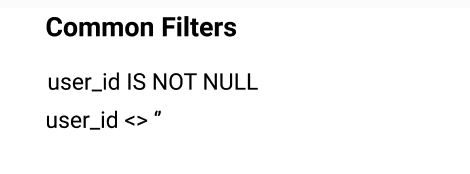

- Feature Name: Index queries and query composition
- Start Date: 2021-05-12
- RFC PR: [amundsen-io/rfcs#0000](https://github.com/amundsen-io/rfcs/pull/0000) (after opening the RFC PR, update this with a link to it and update the file name)
- Amundsen Issue: [amundsen-io/amundsen#0000](https://github.com/amundsen-io/amundsen/issues/0000) (leave this empty for now)

# Index queries and query composition

## Summary

Add indexing of queries, and the components of the query, to Amundsen. The components of the query included in this RFC are where clauses and joins.

## Motivation

Queries are one of the most common ways that users interact with data and there is a significant amount of latent information that exists within the queries that have been executed which can be useful for users to discover. By indexing queries and their individual components Amundsen will be able to answer questions such as:

- What tables are most commonly joined to this table and how?
- Are there any filters (where clauses) that are always applied when accessing this table?
- What real-world queries are being used on this table?
- What queries are relevant now, given the recent queries that have been executed?

This information helps users to discover _how to use_ their data.

## Guide-level Explanation (aka Product Details)

Four new asset types are added to Amundsen as depicted in the following diagram:

1. **Query**: these contain the full SQL for a query as well as relationships to Tables, Users, Query Executions, Joins and Wheres
2. **Query Execution**: this represents the total number of times a query was executed within a time window. By having query executions separated from queries Amundsen can keep one copy of the query in the database and sum the total number of executions at any point in time to get the total execution count. Query Executions can be added or dropped to add or remove relevance to a Query, Join or Where
3. **Join**: this is a component of a query, a single join clause (e.g. `table_1 a join table_2 b on a.field = b.field`). Joins are connected to the columns they are joined on as well as to queries. By connecting to queries, Amundsen can rank order the most frequent joins by accessing the query executions.
4. **Where**: this is a component of a query, a single where clause (e.g. `where field_a is not null`). Wheres are connected to columns as well as to queries. By connecting to queries, Amundsen can rank order the most frequent wheres by accessing the query executions.

## UI/UX-level Explanation

Amundsen will display the most common filters and frequent joins based off of query execution counts:

Common filters:

Display common joins:

Queries can also be displayed for tables similar to how queries are shown for dashboards.

## Reference-level Explanation (aka Technical Details)

Four new models will be added to support the data assets listed above:

1. Query
    - Attributes:
        - sql: the SQL code for the query
        - tables: a list of Table Metadata representing each table used in the query
        - clean_sql: an optional SQL string that the implementer has curated. For example, if an Airflow DAG injects the date into a SQL query every day, the implementer may strip that date and pass the updated SQL into `clean_sql` in order to allow Amundsen to identify that this is not a unique query.
        - user: an optional user that executed the query (should be Amundsen user ID)
    - Relations:
        - Table > Query
        - User > Query
2. Query Execution
    - Attributes:
        - query: the query model defined above
        - start time: The start time of the window that the aggregation represents. Query executions can be dropped from the database when start time > X in order to update the most commonly used joins and wheres.
        - execution_count: the total # of times the query was executed in the window
        - window_duration: a string representation of the window length. Amundsen will not enforce non-overlapping windows, users should schedule a job to create query executions on defined cadence.
    - Relations:
        - Query >> Query Execution
3. Join
    - Attributes:
        - left_table: Table Metadata for the left table in a join
        - right_table: Table Metadata for the right table in a join
        - left_column: Column Metadata for the left column in a join
        - right_column: Column Metadata for the right column in a join
        - join_type: a string representing the join type, could be `inner join`, `left outer join`, etc
        - join_operator: a string representing the operator, could be `=`, `>`, `<=`, etc.
        - join_sql: the sql code for this join (e.g. `table join table2 on table.a = table2.b`)
        - query: The query model defined above
    - Relations:
        - Column >> Join
        - Query >> Join
4. Where
    - Attributes:
        - tables: a list of Table Metadata representing each table used in the query. The columns in the table metadata should be used in the where clause
        - where_clause: a string representation of the SQL where (e.g. `field < 4` or `val is null`)
        - query_metadata: The query model defined above
    - Relations:
        - Column >> Where
        - Query >> Where

## Drawbacks

Parsing query logs can be a large effort, therefore this approach will be designed in a way such that implementers will be able to send a raw query into Amundsen without the other components (executions, joins and wheres) but will loose the ability for the features built on top of those data assets such as ordering by most common query, showing the most common filters, etc. However, Amundsen is not intended to hold a copy of each query each time it is executed and implementers should take some effort to dedupe queries.

## Alternatives

- Do not index queries and query components
- Only index queries, not components of queries

## Prior art

[PR 27](https://github.com/amundsen-io/rfcs/pull/27) had been opened to add queries as first class objects. This PR did a good job to raise awareness of the need for having queries as first-class objects but this PR expands on that in a few areas:

- Abstracting query executions as an aggregation instead of persisting each instance a query is executed
- Associating query directly to table but associating components (e.g. join, where) to columns

## Unresolved questions

n/a

## Future possibilities

- Display queries at the table level similar to how queries are displayed for dashboards
- Create additional Query components (e.g. most commonly selected fields, most common transformations applied to fields, etc.)
- Create a default job to remove old query executions
