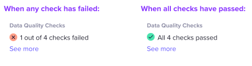

- Feature Name: table_data_quality_checks
- Start Date: 2021-07-16
- RFC PR: [amundsen-io/rfcs#XX](https://github.com/amundsen-io/rfcs/pull/XX)
# Table Data Quality Checks

## Summary
This RFC will define a generic interface for accessing data quality checks in Amundsen. If available, we aim to expose
the status of these data quality checks in the Amundsen Table Details page.

## Terms
- Data Quality Check - Like unit tests for code, data quality checks are assertions that try to guarantee certain 
  characteristics of data. For example a data quality check could be as simple as asserting that a column is not null,
  or implement some complex custom logic.

## Motivation
While Amundsen is not currently building unit tests for data, we can empower our users by allowing integrations 
with a generic external data quality service. Exposing the status of data quality checks in Amundsen can give users 
an at-a-glance summary of the table's quality. This can help a user to quickly decide if they want to use this table.

## Product Details
Users will see a new section on the left panel of the Table Details page titled `Data Quality Checks`. There will be
a message and icon for the current status of these checks, if they exist. A passing table might say 
`✅ 10 of 10 checks passed` and a failing table might say `❌ 3 of 10 checks failed`. Additionally, the user may see 
the last run timestamp, and a link to the external data quality service, if available.

## UX Explanation

## Technical Details

like `num_checks_success`, `num_checks_failed`, and `external_url`.

## Drawbacks

## Alternatives

## Prior Art

## Unresolved Questions

## Future Possibilities
