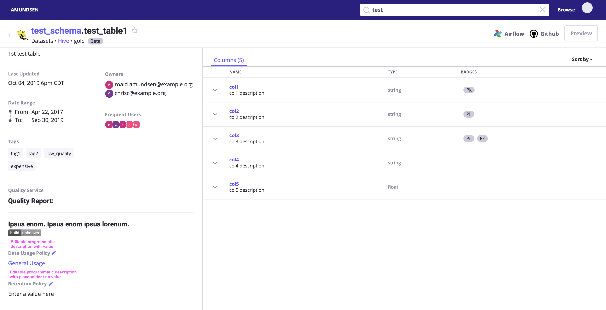

- Feature Name: editable_programmatic_descriptions
- Start Date: 2021-07-27
- RFC PR: [amundsen-io/rfcs#42](https://github.com/amundsen-io/rfcs/pull/42)
- Amundsen Issue: [amundsen-io/amundsen#0000](https://github.com/amundsen-io/amundsen/issues/0000)

# Editable Programmatic Descriptions

## Summary

Programmatic descriptions are a useful way for Amundsen users to store and display business specific metadata about their tables in Amundsen. This feature allows for some customization of Amundsen without customizing the underlying software. Currently, this feature focuses on the machine generated metadata use case. This type of data can be extracted from the source system of truth and ingested into Amundsen via databuilder.

The same need exists for business specific human generated metadata. This type of data does not exist in a machine generated form that can be easily extracted from a source system. Instead, users need to add/edit this metadata directly in the Amundsen UI. 

## Motivation

This feature allows users to configure their Amundsen installation to support one or more editable programmatic descriptions. These editable programmatic descriptions allow users to enrich the metadata displayed on the table details page with additional business specific human generated information. This feature will allow them to add/edit these programmatic descriptions directly in the UI.

## Guide-level Explanation (aka Product Details)

An editable programmatic description is the same as a regular programmatic description, except that it is maintained directly in the UI by a human instead of by a scheduled databuilder job. For example, users could configure an editable programmatic description with a source of data_usage_policy and then update the data_usage_policy on individual table detail pages with a link to the applicable data usage policy on their company's content management site.

Similar to table descriptions, if a table is disabled for editing, then so are the editable programmatic descriptions.

Databuilder jobs may still be useful on a one-off (i.e. non-scheduled basis) to seed Amundsen with manually curated data or perform one-off data conversations.

There will be no impact to existing programmatic descriptions. They will remain non-editable via the UI unless users intentionally update the existing configuration in their Amundsen installation to make them editable.

## UI/UX-level Explanation

Editable programmatic descriptions would be displayed alongside programmatic descriptions in the same way they are displayed today. They will be rendered as markdown, located in one of three sections (left, right, other) in the page and sorted according to display_order.

There are two differences between editable and non-editable programmatic descriptions:
1. They are editable (if the table is editable)
2. They will always be displayed. If there is not a value then placeholder text will be displayed instead.

_**Note:** The pink text is only visible in the mocks to call out design details and changes._


## Reference-level Explanation (aka Technical Details)

The implementation will require:
- Updates to the frontend and metadata service to support editing programmatic descriptions via the API
- Updates to the frontend to display editable programmatic descriptions in the table details page 

### Metadata

- Add an optional "description_source" parameter to the existing put_table_description API endpoint that defaults to None.
- Update the put_resource_description framework to support this new parameter as well

### Frontend

- Update put_table_description and updateTableDescription to optionally support "description_source"
- Update _convert_prog_descriptions to always include editable programmatic descriptions regardless if there is a value. programmatic descriptions default to non-editable unless explicitly specified (see below for backwards compatible format for PROGRAMMATIC_DISPLAY)

```
PROGRAMMATIC_DISPLAY = {
    'RIGHT': {
      "test3" : {},
      "test2" : { "display_order": 0 } # "editable" defaults to "false" for all programmatic descriptions
    },
    'LEFT': {
      "test1" : { "display_order": 1, "editable": "false" },
      "test0" : { "display_order": 0, "editable": "true" },
    },
    'test4': {"display_order": 0, "editable": "true" },
}
```

- Update TableDescEditableText to support editable programmatic descriptions and use it in place of EditableText in our current implementation of renderProgrammaticDesc
- Set the editable property for programmatic descriptions based on both the description (i.e., editable) and the table (i.e., is_editable)

## Drawbacks

We cannot think of a major reason not to do this. The implementation and maintenance costs seem relatively low given the existing programmatic descriptions feature, as does the impact on users onboarding and learning about Amundsen. Also, this implementation will not introduce any breaking changes.

This feature does highlight the need for a full fledged permissions/ACL model in Amundsen. However, this implementation uses the existing permission pattern for editing tables and therefore should not introduce an additional burden on users or maintainers.

## Alternatives

This design is the best approach because it takes advantage of the existing programmatic descriptions feature to enable the additional use case of business specific human generated table metadata.

Tags were considered but do not seem feasible given that the values of human generated programmatic descriptions may include medium to long text and may benefit from markdown formatting.

Table descriptions were considered but would result in a degraded UX since it would be harder for users to visually separate fields and more importantly, harder for users to ensure they did not accidentally update other editable programmatic descriptions stored in the same table description field.

The impact of not doing this is most likely one of a few outcomes:
- More users fork Amundsen to add support for their own business specific table metadata
- Users continue to track this business specific human generated table metadata in disparate locations (e.g., spreadsheets, confluence, etc.) and as a result the value they receive from Amundsen is unnecessarily limited

## Prior art

- [Programmatic descriptions feature request](https://github.com/amundsen-io/amundsen/issues/147)

## Unresolved questions

We consider the question of a permission/ACL model for Amundsen to be out of scope for this RFC.

## Future possibilities

Future work could involve adding support for programmatic descriptions (editable or not) to dashboards or other entities as clear use cases arise.
