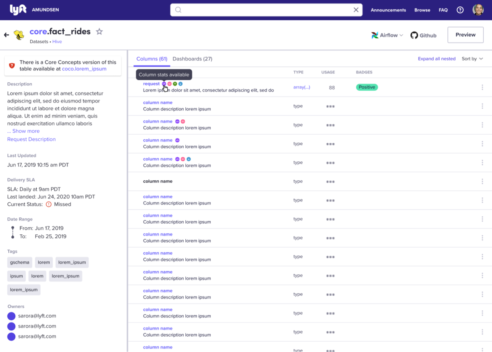
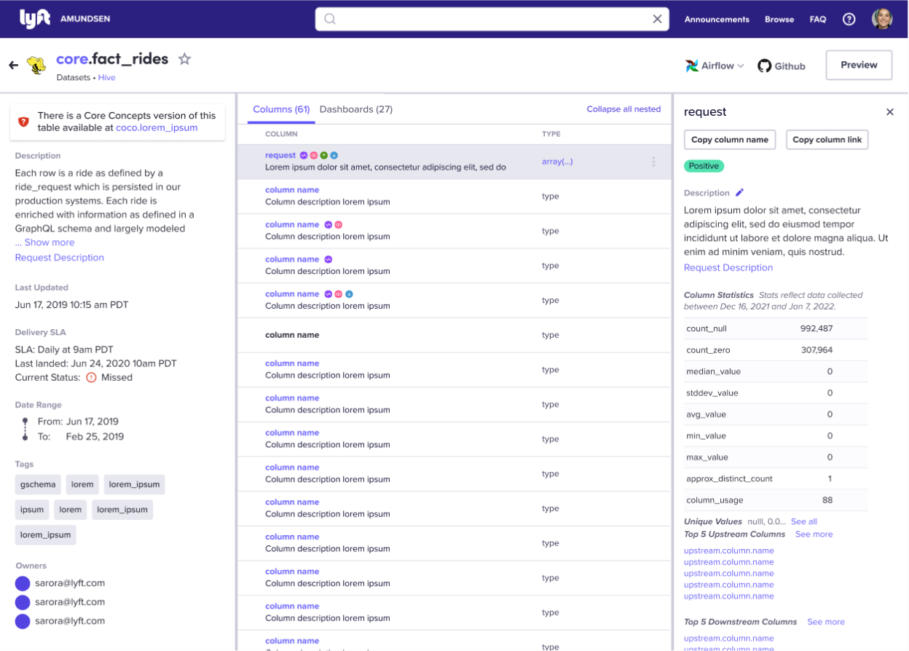
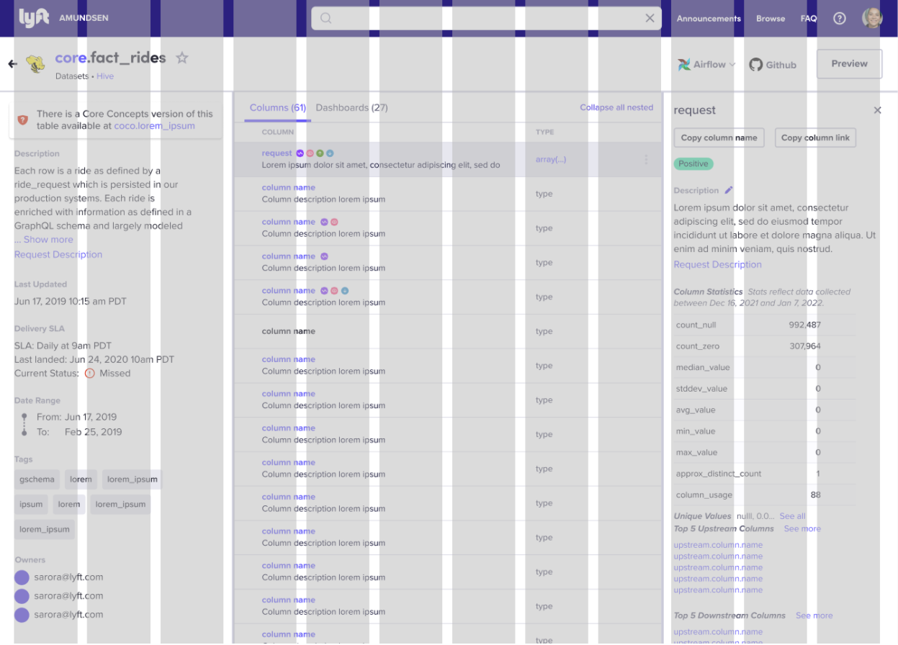
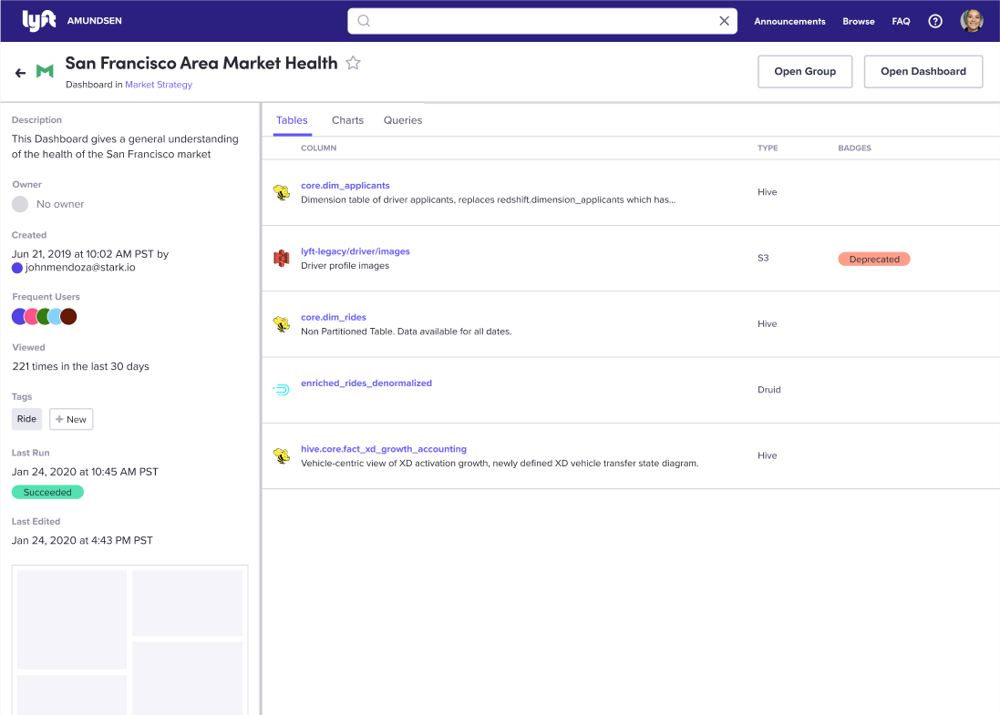
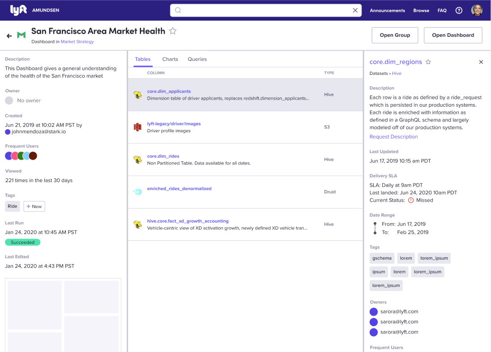
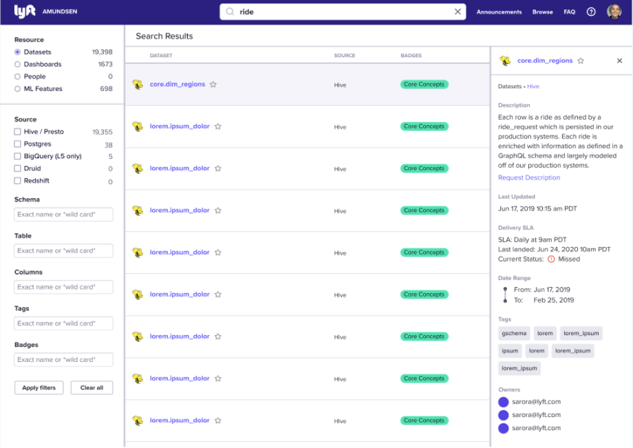
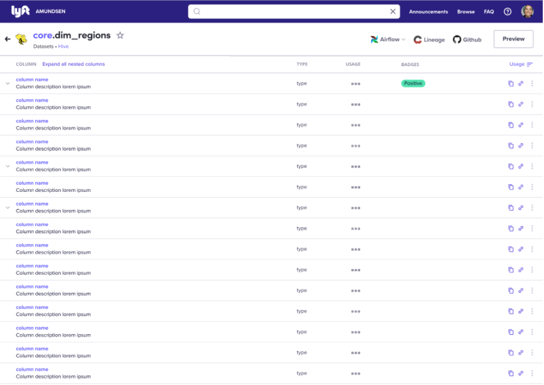
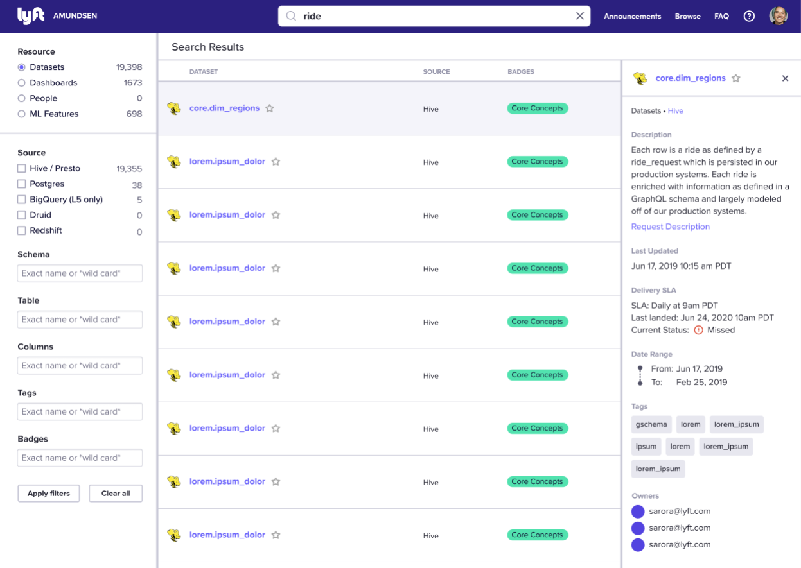
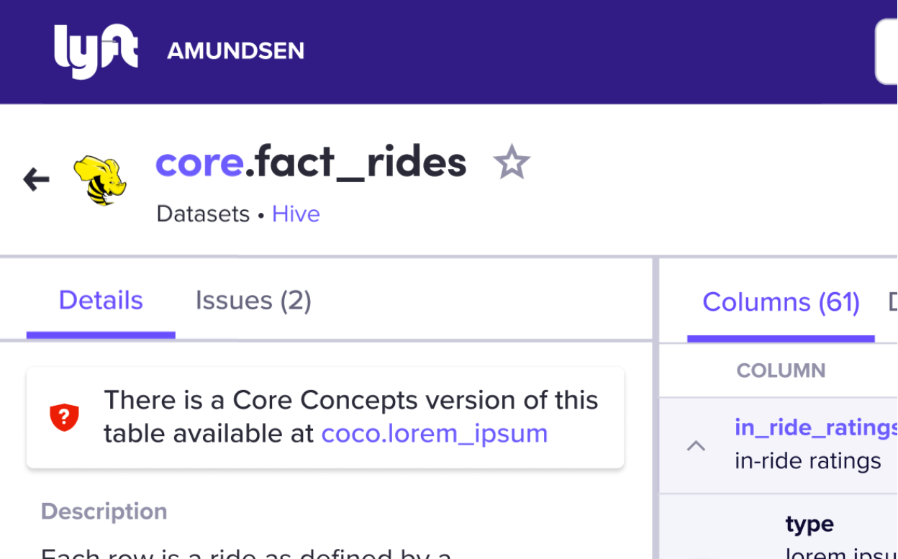

- Feature Name: Column details access and side panels
- Start Date: 2022-03-24
- RFC PR: [amundsen-io/rfcs#046](https://github.com/amundsen-io/rfcs/pull/46) (after opening the RFC PR, update this with a link to it and update the file name)
- Amundsen Issue: [amundsen-io/amundsen#0000](https://github.com/amundsen-io/amundsen/issues/0000) (leave this empty for now)

# Column details access and side panels

## Summary

We propose updating the UI layout and adding a right side panel to improve the way users access column details (including full description, stats and more). This side panel could later be used to quickly preview table metadata in the search results page.

## Motivation

Currently, our users need to click on the ⌄ icon to expand column details to see the full description and stats. The problem with this interaction is that... 
1. the expanded section takes up a lot of space and pushes down other columns in the list, 
2. it is not scalable as we look to add more column metadata, and 
3. the location of the ⌄ icon will clash with ↳ icon in complex tables that contain nested columns (as specified in [Nested Columns RFC](./047-nested-columns.md).) 

Also, this layout change could potentially improve our search results page, by providing a new way to preview table metadata in a right side panel without leaving the results page, so that users could compare and decide which table details page they want to click into.

## Guide-level Explanation (aka Product Details)

You can now see column details on the right side panel instead of expanding the row in the table area. 
Click on any of the active columns and the panel will slide out from the right side. You can close it by clicking on the x at the top right corner. 

## UI/UX-level Explanation

### Narrower table metadata section and column metadata indicators

* Table metadata panel on left will be narrower, taking up 3 out of 12 columns instead of 5
* All normal/top-level columns will not have a chevron to expand column details within the list, but the columns with description, stats, unique values, upstream columns and/or downstream columns will have a clickable column name, shown in interactive (Indigo 60) color.
* The chevron will now have a new purpose: to expand/collapse nested columns hierarchy. See more details about the new chevron interaction, how we will visualize nested columns in this new layout, also utilizing the right side panel, in the [Nested Columns RFC](./047-nested-columns.md).
* After each clickable column name, small color-coded metadata indicator icons will show users which types of info are available for the column, even before they click on the column to see the details.
* If a column does not have any description, stats, unique values, upstream columns and/or downstream columns info to show, the name will not be clickable, and therefore shown in regular black text.

### Column details in right side panel

* Clicking on a column name will highlight (Gray 10) the selected column and open up the right side panel, which properly displays all column details. This right side panel will also take up 3 out of 12 columns. (See below for layout grid view)
* Users can copy the full column name, copy column link, edit description, see all other column metadata, and/or click x to close the side panel.

### Other resource types

This layout can be applied to all other resource types, to have a narrower metadata section on the left, and showing details of a selected list item in the right side panel.

For example, Dashboard page will look like this in default state:

Then users can click on a table in the list to view table metadata:

* This same right side panel can be used in the search results page in the future, to preview table metadata before going into a table page.

## Reference-level Explanation (aka Technical Details)

We’ll update the layout to reduce the left sidebar and add a collapsible right sidebar. We’ll probably tackle it with a simple <aside> tag and a simple animation.

The size of the table showing the column info will be reduced when the right panel opens to ensure the column types and actions are not hidden behind it. When the side panel opens, the table area will
* Column names, nested column hierarchy (e.g. indentation), description, column type and action button will stay in the table area
* Usage and badges will be hidden from the table area, but displayed in the right side panel. 

## Drawbacks

We have held off on major layout changes due to implementation cost and disruption of existing UI, but the column list area is getting crowded as we add more column metadata, and is not flexible enough to add the [nested columns improvements](./047-nested-columns.md) we want to make.

## Alternatives

We have explored several directions while designing for [nested columns](./047-nested-columns.md), and decided against them because…

### Chevron to expand nesting, + icon to open column details

* The chevron feels appropriate for expand/collapsing hierarchy in the list, but it’s not easy to add another CTA that will open column details in the same area (near column names)
* Two types of expanding actions in the same list can easily take up a lot of vertical space, making it hard to scan and compare multiple columns

### Table metadata in search results page, column metadata in table page

* We thought about removing the table metadata section from the table details page to make more room and show column info, but it’s important to see the table metadata together with the list of columns.

* A dedicated panel will help properly show all column metadata, but it didn’t have to be this wide.

## Prior art

No prior art, but this follows common patterns in web applications.

## Unresolved questions

None

## Future possibilities

### Table metadata preview in right side panel

In the future, we can preview table info in the search page too, using the same layout.

* Clicking on one of the search results could bring out the right side panel to allow a preview of table metadata before users click the ‘See columns’ button to go into the full table details page.

### Tabs for table metadata panel
If the table metadata gets so long to scroll down, we could use tabs to break up the content e.g. move the Issues to separate tab:

### Dedicated column page

As @mgorsk1 has suggested, we could add a full, dedicated column page in the future, when the column details and metadata scales up so much that it no longer fits inside the side panel.

